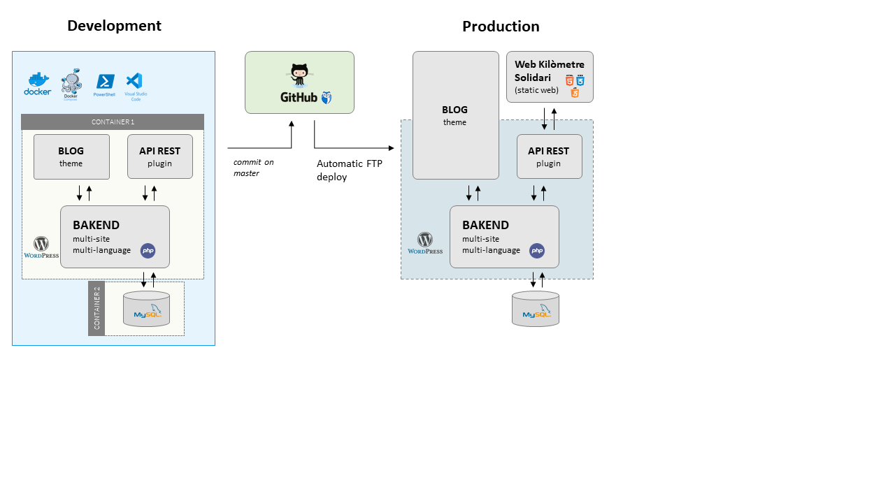

# Wordpress development environment configuration
**A reporitory of JS Project** :rocket:  
https://www.jordisabadell.com

## Challenges
This repository has been created from the following challenges.

- [x] Configure local WordPress development environment using Docker.
- [x] Enable multisite and multilingual.
- [x] Expose REST API.
- [x] Add security WordPress plugin.
- [ ] Create a CI/CD environment (development-production life cycle)

## Architecture diagram



## Installed Wordpress plugins
- Akismed (https://wordpress.org/plugins/akismet/)
- iTheme Security (https://wordpress.org/plugins/better-wp-security/)
- Polylang (https://wordpress.org/plugins/polylang/)

---

## Steps to configure development environment

### Docker

Create an empty folder.
```
mkdir jsproject-wordpress
cd jsproject-wordpress
```

Connect to Github repository.
```
git init
git remote add origin https://github.com/jordisabadell/jsproject-wp-environment
git pull origin master
```

Build containers.
```
docker-compose up -d
```

### Install Wordpress and update plugins

Access to Wordpress and follow wizard installation.  

After that, if you can't update (or install) plugins you must enable filesystem method adding the following line to the end of the file */wordpress-files/wp-config.php* (reference https://www.digitalocean.com/community/questions/how-to-fix-wordpress-connection-information-on-wp-that-is-running-in-a-docker-container):
```
define('FS_METHOD','direct');
```

Install iTheme Security plugin.

### Multisite

Enable Wordpress multisite (reference https://gonzalonavarro.es/blog/wordpress-multisite/).

1) Add the following line to the end of the file */wordpress-files/wp-config.php*
```
define( 'WP_ALLOW_MULTISITE', true );
````

2) Access to Newtwork configuration from Backoffice, and enable it.  

3) Replace file */wordpress-files/.htaccess*
```
RewriteEngine On
RewriteBase /
RewriteRule ^index\.php$ - [L]

#add a trailing slash to /wp-admin
RewriteRule ^([_0-9a-zA-Z-]+/)?wp-admin$ $1wp-admin/ [R=301,L]

RewriteCond %{REQUEST_FILENAME} -f [OR]
RewriteCond %{REQUEST_FILENAME} -d
RewriteRule ^ - [L]
RewriteRule ^([_0-9a-zA-Z-]+/)?(wp-(content|admin|includes).*) $2 [L]
RewriteRule ^([_0-9a-zA-Z-]+/)?(.*\.php)$ $2 [L]
RewriteRule . index.php [L]
```

4) Add New Site from Backoffice menu.


### Multilingual

Install Polylang plugin.  

**Important!** You must define a default lang for each site. Otherwise it returns a 404 error.  

Enable lang to CPT contents (https://polylang.pro/doc/multilingual-custom-post-types-and-taxonomies/). In this case, Polylang doesn't let you to define a lang to CTP content. You must define every content manually and republish.  

**Important!** Get multilingual contents using Polylang and default WordPress REST API is not available. The feature is available only in Polylang Pro. (https://polylang.pro/doc/rest-api/).

---

## Docker basic commands
Use **Poweshell** command line.

View images.
```
docker images -a
```

Remove an image/all images.
```
docker rmi -f {IMAGE ID}
docker rmi -f $(docker images -a -q)
```

View containers.
```
docker ps -a
```

Remove a container/all containers.
```
docker container rm {CONTAINER ID}
docker rm -vf $(docker ps -a -q)
```

Stop containers execution.
```
docker-compose stop
```
