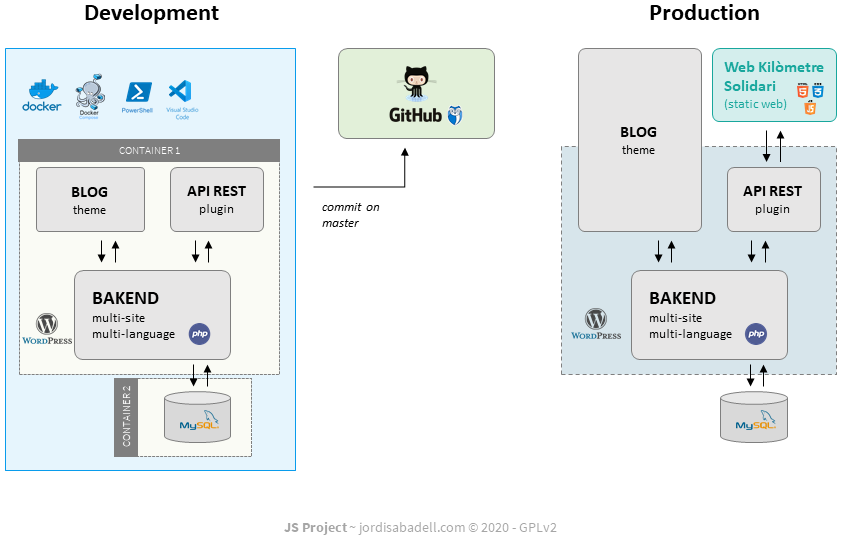

# Jordi Sabadell Wordpress
**A web of Jordi Sabadell Project** :rocket:  
https://www.jordisabadell.com

## Challanges
This static web has been created from the following challenges.

- [x] Configure Wordpress/MySQL local environment with Docker.
- [ ] Install multisite / multilanguage Wordpress (2 sites: Jordi Sabadell and Kilòmetre Solidari).
- [ ] Install basic plugins (Akismet, Yoast, JSON API, etc).
- [ ] Install new theme for Jordi Sabadell Blog.
- [ ] Create a Wordpress Custom Post Type and expose to JSON API.
- [ ] Add Static Site Generator for WordPress for Serverless deploy.
- [ ] Create a CI/CD environment (development-production life cycle).

## Architecture diagram




## Configuració entorn de treball

Crear el directori arrel i l'arxiu de configuració de Docker Compose.
```
mkdir jordisabadell-wordpress
cd jordisabadell-wordpress
echo ''  > docker-compose.yml
```

Copiar l'arxiu de configuració de Docker Compose.
```
Fer un copy-paste de l'arxiu docker-compose.yml
```

Iniciar l'entorn.
```
docker-compose up -d
```

## Comandes bàsiques Docker 
Per executar les comandes en entorn Window usar **PowerShell**.

Veure les imatges.
```
docker images -a
```

Eliminar una imatge.
```
docker rmi -f {IMAGE ID}
```

Veure els contenidors.
```
docker ps -a
```

Eliminar un contenidor.
```
docker container rm {CONTAINER ID}
```